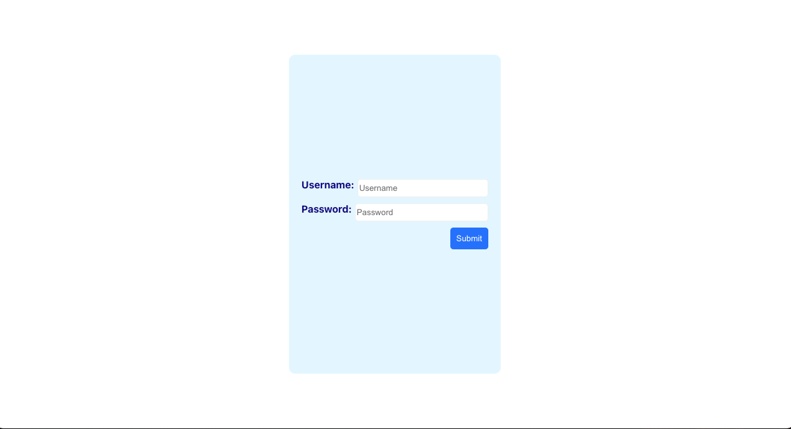
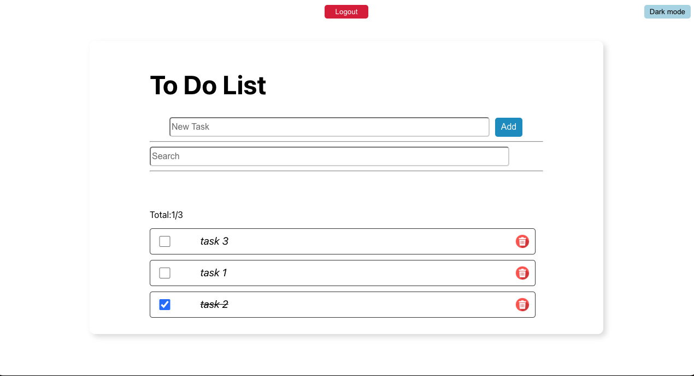
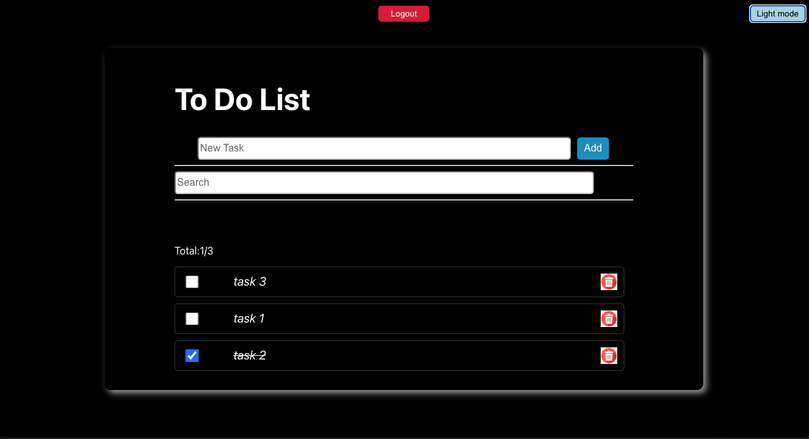

# To test the apps, enter below username and password:
- username: kat
- password: pass2
# Project Objectives
To apply React concepts and libraries to build a functional web application :
- Create React project using Create React App with npx
- Build and structure React components
- Implement props for passign data between components
- Utilize dynamic component rendering techniques
- Apply React useState hook for state management
- Implement JavaScript array methods: map, includes, filter, findIndex, some, reduce, sort, push
- Utilize JavaScript ES6 destructuring for objects and arrays
- Implement JavaScript ES6 arrow functions
- Styled-components for CSS-in-JS styling: https://styled-components.com/

# Features
1. Login 
- Validate username and password inputs against user credentials in pre-defined userList
- Grant access to the Todo List component upon successful authentication
- Display an alert for unsuccessful login attempts, prompting user to re-enter credentials
2. Todo-list management
- Add new to-do task
- Delete existing to-do task
- Mark tasks as completed
- Implement task search functionality
- Sort tasks based on different criteria
- Display task statistics (total tasks and completed tasks)
- Toggle between dark and light mode for user interface
**login page**

**light mode**

**dark mode**

# Development Tools 
* Visual Studio Code as the primary code editor
* Git for version control and collaboration
* Node.js and npm for package management and running scripts
